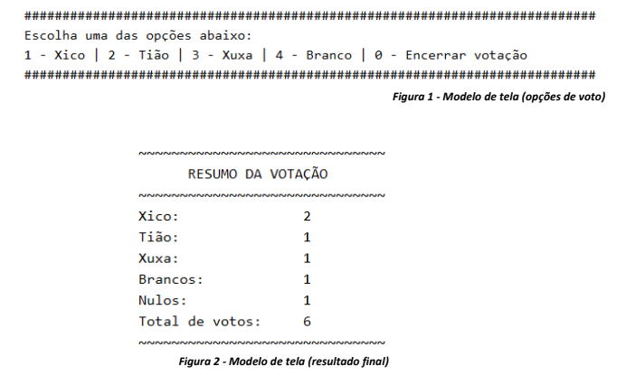

# Avaliação (versão 1)

1. O grêmio escolar está em período de eleições. Você foi requisitado para criar um sistema de
votação semelhante a uma urna eletrônica. Seu sistema precisa receber os votos nos candidatos e
exibir um boletim final com a quantidade de votos que cada um recebeu, além dos votos em
branco e nulos. Leia atentamente os requisitos do sistema abaixo e crie um programa de acordo
com a descrição.
1.1. As eleições têm apenas três candidatos que já devem estar cadastrados na hora da votação. O
sistema registrará apenas o voto de cada eleitor. Ou seja, VOCÊ, programador quem deve
informar quem são os candidatos. Use nomes fictícios ou genéricos, tipo, candidatos A, B e
C.
1.2. O sistema deve permanecer em execução recebendo os votos até que seja informada uma
opção de encerrar a votação.
1.3. O sistema tem que informar quem são os candidatos e o número de votação de cada um, além
da opção votar em branco (figura 1).
1.4. O voto só é considerado NULO quando o eleitor (usuário) digitar outro número que não seja
de nenhum candidato.
1.5. Quando o usuário informar a opção para encerrar a votação, o sistema deve apresentar o total
de votos registrados, a lista com os candidatos, a quantidade de votos que cada um recebeu e
também a quantidade de votos em branco e nulos (figura 2).
1.6. As telas do sistema não precisam ser exatamente iguais as exibidas nas figuras. Os modelos
são apenas uma referência para orientar a criação do algoritmo.

