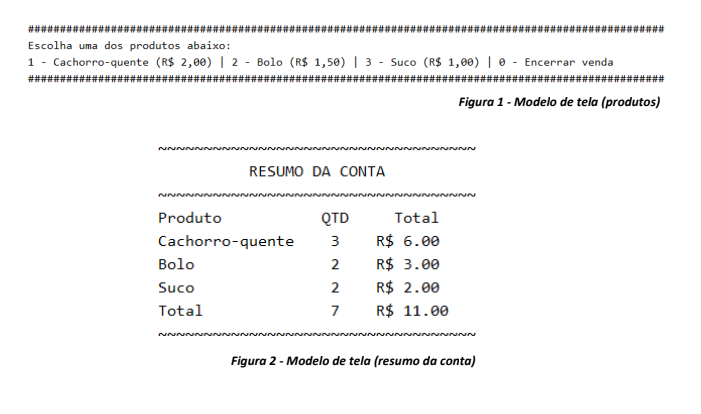

# Avaliação (versão 2)

1. A lanchonete da escola decidiu que precisava se adequar as novas demandas tecnológicas e
requisitou você para desenvolver um sistema para registrar as vendas. Seu sistema deve exibir os
itens disponíveis para venda, receber a quantidade de itens vendidos e exibir no final o valor da
conta. Leia atentamente os requisitos do sistema abaixo e crie um programa de acordo com a
descrição.
1.1. A lanchonete só vende atualmente três produtos: bolo, cachorro-quente e suco. Os produtos
vendidos na lanchonete já devem estar cadastrados no sistema e ele deve apenas exibir os itens
no menu. VOCÊ programador quem deve registrar os produtos e o preço de cada um. Use
valores hipotéticos para cada um.
1.2. O sistema deve permanecer em execução registrando cada produto vendido até que seja
informada a opção de encerrar a venda e exibir o valor total da conta.
1.3. O sistema tem que informar quais são os produtos e o preço de cada um, além da opção de
encerrar a venda (figura 1). Quando o usuário escolhe um produto, o sistema deve receber
também a quantidade desse produto para calcular o total vendido desse item. Caso o usuário
digite uma opção não existente dentre as informadas, o sistema não deve fazer nenhum cálculo,
exibir na tela uma mensagem de opção inexistente e volta ao menu com as opções.
1.4. Quando o usuário informar a opção para encerrar a venda, o sistema deve apresentar a
quantidade de cada produto vendido, o total da venda individual de cada produto e o total da
venda geral considerando todos os produtos vendidos (figura 2).
1.5. As telas do sistema não precisam ser exatamente iguais as exibidas nas figuras. Os modelos
são apenas uma referência para orientar a criação do algoritmo.

## Use pip install PrettyTable para o programa excutar corretamente.