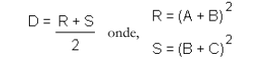

1. Escreva um algoritmo que calcule e exiba o resultado para a expressão D abaixo. Seu programa
deve receber do usuário valores para A, B e C.

2. A nota final de uma disciplina no ensino médio do IFRN é resultado do cálculo da média
ponderada de quatro notas correspondentes aos quatro bimestres usuais. As notas dos bimestres
possuem “pesos” diferentes no cálculo da média ponderada. Os dois primeiros bimestres
possuem peso 2 e os dois últimos peso 3. Sabendo que a média não pode ser representada por
um valor com casas decimais, crie um programa que calcule e apresente a média como um inteiro.
O programa recebe como entrada quatro valores correspondentes as notas de cada unidade.
3. Faça um programa para uma loja de tintas. O programa deverá pedir o tamanho em metros
quadrados da área a ser pintada. Considere que a cobertura da tinta é de 1 litro para cada 3 metros
quadrados e que a tinta é vendida em latas de 18 litros, que custam R$ 150,00. Quando o usuário
informar o tamanho da área a ser pintada, o programa precisa calcular (e informar esses valores
na saída) a quantidades de latas de tinta a serem compradas e o preço total da compra. Obs.:
somente são vendidas latas inteiras, então não dá para comprar duas latas e meias, por exemplo.
4. Supondo que não haja acidentes ou atrasos, a distância que um automóvel percorre numa rodovia
pode ser calculada com a seguinte fórmula:

Distância = velocidade × tempo

Sabendo disso, construa um algoritmo em que o usuário possa informar a velocidade em que um
carro está viajando e exiba as seguintes informações:
• A distância que o carro percorrerá em 5 horas;
• A distância que o carro percorre em 8 horas;
• A distância que o carro percorrerá em 12 horas.
5. Nos EUA, a unidade de distância é a milha e unidade de volume para abastecimento de um
automóvel é o galão. Assim, o valor do consumo em milhas por galão (MPG) de um automóvel
pode ser calculado com a seguinte fórmula:
MPG = Número de milhas percorridas / Número de galões de gasolina consumidos
A partir dessas informações, crie um algoritmo que solicite ao usuário a distância percorrida pelo
automóvel em milhas, quantos galões de gasolina foram consumidos para percorrer essa distância
e calcule o consumo em milhas por galão. Considerando que no Brasil usamos quilômetros e
litros invés de milhas e galões, seu programa deve exibir na tela, além do valor em milhas por
galão, o valor do consumo em quilômetros por litro. Para fazer a conversão entre as unidades de
medida, leve em consideração que um galão contém cerca de 3,78 litros e uma milha equivale a
1,61 quilômetros.

6. Gorjeta, Imposto e Total Pago – Crie um algoritmo para calcular o valor a ser pago por pessoa
em um restaurante. O usuário precisa informar o valor consumido e a quantidade de pessoas para
dividir a conta. A partir desse valor, o algoritmo deverá calcular o valor da gorjeta (10% sobre o
valor consumido), dos impostos (7%) e o total a ser pago (valor do consumo mais os valores da
gorjeta e dos impostos). Ao final, o algoritmo deverá exibir cada um desses valores, o total, a
quantidade de pessoas e o valor por pessoa.
7. Ajustador de receitas – Uma receita de biscoitos para produzir 48 unidades exige a seguinte
quantidade de ingredientes:
a) 1,5 xícaras de açúcar
b) 1 xícara de manteiga
c) 2,75 xícaras de farinha
d) 3 ovos
Crie um algoritmo que pergunte ao usuário quantos cookies ele deseja fazer e calcule a quantidade
correspondente dos ingredientes. Exemplo: as quantidades listadas servem para fazer 48
unidades. Se o usuário quisesse produzir 96 unidades (ou seja, o dobro de 48) as quantidades dos
ingredientes devem ser dobradas: 3 xícaras de açúcar, 2 xícaras de manteiga, 5,5 xícaras de farinha
e 6 ovos. Do mesmo modo, se a quantidade de biscoitos for menor que 48, o algoritmo também
deve fazer o ajuste.